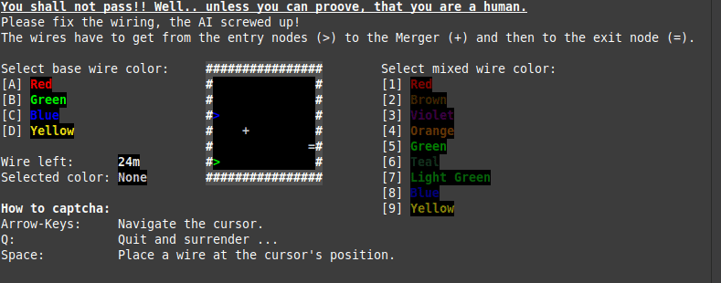

# Console Captcha

This fun program was created for the [Laurie Wired Programming Challenge 2024](https://github.com/LaurieWired/Halloween_2024_Programming_Challenge). 

It brings the well-loved Captcha requests to the Terminal world. The program is written in C++ on Linux Mint 21 and can be compiled with g++ (see the [Makefile](./Makefile)).



For a precompiled version, see the [Releases](releases) section of this repository.

## Compile on Linux

```
# just compile
make

# cleanup target directory before compile
make rebuild
```

The executable will be created as file: `./target/console-captcha`

## Compile on Windows

Since the required dependency `termios.h` is not included in MinGW, cross-platform compilation is not supported. But the program can be compiled directly on Windows using [CygWin](https://cygwin.com/).

### Required Cygwin dependencies

Select the following custom packages in the Cygwin setup:
- make (4.4.1-2)
- gcc-g++ (12.4.0-3)
- cygwin-devel (3.5.4-1)

### Compile in Cygwin Terminal

```
# just compile
make win

# cleanup target directory before compile
make rebuild-win
```
